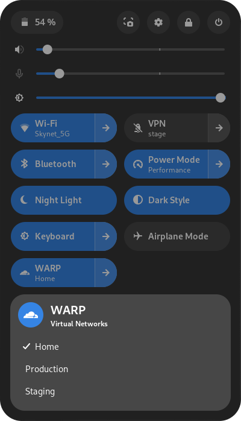

# Cloudflare WARP Gnome Quick Settings

A Gnome shell extension that allows you to quickly enable and disable Cloudflare WARP and change the Virtual Network from the Quick Settings menu.

<center>
  
</center>

## Installation

To install the extension, follow these steps:

1. Clone the repository:

   ```bash
   git clone git@github.com:naueramant/gnome-cloudflare-warp.git
   ```

2. Navigate to the project directory:

   ```bash
   cd gnome-cloudflare-warp
   ```

3. Run the install script:

   ```bash
   ./install.sh
   ```

4. Restart Gnome Shell by pressing `Alt + F2` and typing `r` and pressing `Enter`.

## Uninstallation

To uninstall the extension, run the uninstall script:

```bash
./uninstall.sh
```

## Development

Development is done by simple editing the the extension files and running the install script to update the extension.

# License

This project is licensed under the GPL-3.0 License - see the [LICENSE](LICENSE) file for details.
